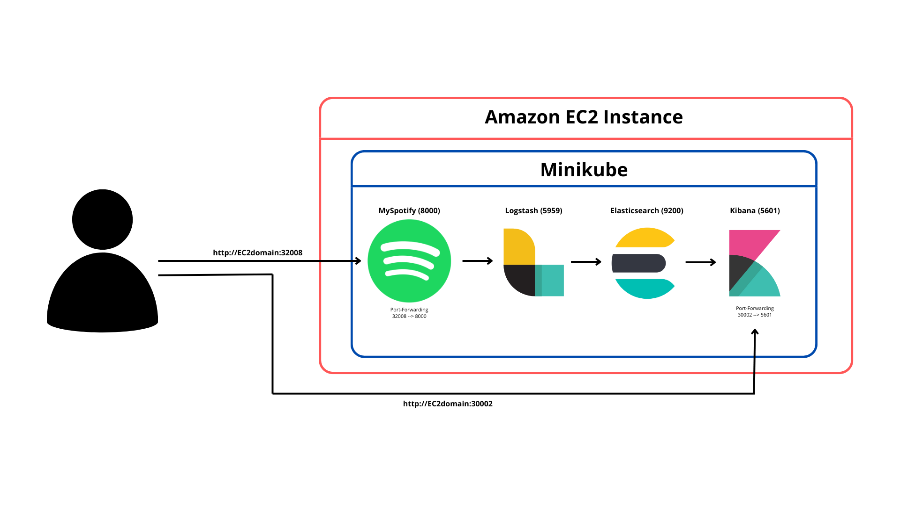
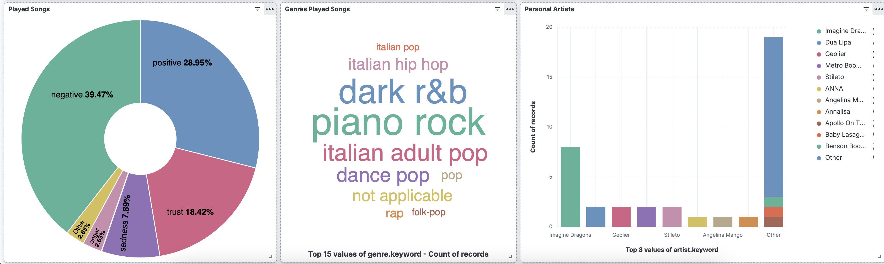
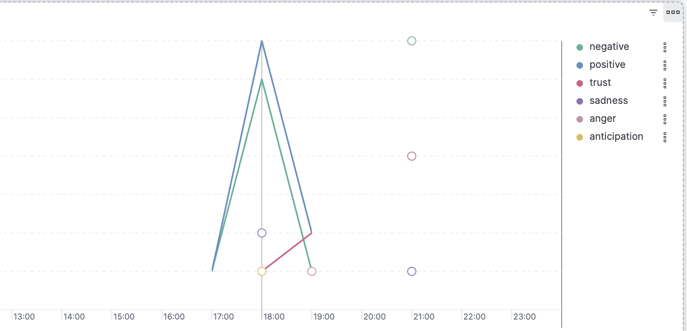

# MySpotify_on_Cloud

## Introduzione

Questo progetto mira a fornire una versione gratuita di Spotify, con l'intento di scoprire come cambiano i gusti dell'utente col passare del tempo. Il servizio è messo in cloud tramite macchina EC2 di AWS, per essere disponibile a chiunque voglia usarlo tramite dominio pubblico.

## Problema

La musica evoca una vasta gamma di emozioni, ma comprendere e quantificare questi sentimenti su larga scala è complesso. Con milioni di canzoni disponibili su Spotify, c'è bisogno di strumenti che possano analizzare automaticamente le emozioni espresse nei brani. Questo progetto affronta questa sfida utilizzando le API di Spotify e di Genius per raccogliere i dati dell'utente e applica tecniche di emotion classification per determinare le emozioni predominanti.

## Architettura del Sistema

L'infrastruttura del progetto è costruita su tecnologie avanzate, distribuite su una macchina EC2 di AWS e orchestrate tramite Kubernetes con Minikube per garantire scalabilità e affidabilità.
 

### Componenti Principali

1. **Raccolta Dati con le API di Spotify**:
   - Le API di Spotify e Genius estraggono informazioni dettagliate sulle canzoni riprodotte usando MySpotify. Questo impiegherà la libreria NRCLex per eseguire l'emotion classification sui testi delle canzoni. Il risultato dell'elaborazione, insieme ad altri dati, verrà inviato a Logstash.

2. **Logstash**:
   - Utilizzato per l'ingestione e la trasformazione dei dati raccolti, preparandoli per l'elaborazione successiva. Questi vengono inoltrati ad Elasticsearch.

3. **Elasticsearch**:
   - Memorizza i risultati dell'analisi, permettendo di indicizzare rapidamente i dati e di eseguire query complesse.

4. **Kibana**:
   - Strumento di visualizzazione per creare dashboard interattive e visualizzazioni grafiche dei dati, consentendo agli utenti di esplorare i risultati dell'emotion classification e gli artisti/generi più ascoltati. 

5. **AWS EC2**:
   - Fornisce l'infrastruttura cloud scalabile per ospitare i componenti del progetto.

6. **Minikube**:
   - Orchestrazione di Kubernetes per la gestione dei container Docker, garantendo un ambiente scalabile e affidabile.

## Come Eseguire il Progetto

### Prerequisiti

- Docker
- AWS EC2
- Kubectl
- Minikube
- Github Actions

### Istruzioni

1. **Clona il Repository**:
   ```bash
   git clone https://github.com/26Marco10/MySpotify_on_Cloud.git
   cd MySpotify_on_Cloud
   ```
2. **Crea una istanza EC2 su AWS**:
    - Crea una istanza EC2 (architettura x86, di tipo t2.large, con 24gb di archiviazione e sistema operativo Ubuntu).
    - Modifica le regole in entrata per le porte 32008 e 30002.
    - Copia il dominio pubblico della macchina appena creata.

3. **Modifica i segreti della repo Github**:
    - Modifica i segreti AWS_SSH_KEY, DOCKERHUB_TOKEN, DOCKERHUB_USERNAME, EC2_DOMAIN, EC2_USER all'interno della repo con i rispettivi valori desiderati.

4. **Configura le variabili d'ambiente**:
    - Visita il link https://developer.spotify.com/dashboard e crea un nuovo progetto. Copia il Client ID e il Client Secret e aggiungili ai file **.env** all'interno delle cartelle MySpotify.
    - Nei settings del progetto creato aggiungi tra i redirect uri il link **http://dominioec2:32008/callback**.
    - Visita il link https://genius.com/api-clients e copia e incolla Client ID nello stello file **.env**

5. **Push su repo Github**:
    - Se modificato qualcosa all'interno della cartella, fare push. Questo eseguirà le istruzioni nelle Github Actions.

6. **Accedi a MySpotify**:
    - Visita http://dominioaws:32008 per accedere a MySpotify.

Uploading Registrazione.mov…
    
7. **Accedi a Kibana**:
    - Visita http://dominioaws:30002 per visualizzare i risultati del sentiment su Kibana.
 
 ## Grafi di Kibana
 
 Kibana mostrerà nella dashboard una serie di grafi. Vengono visualizzate le emozioni, i generi e gli artisti più ascoltati. 
 Inoltre, se si userà MySpotify giornalmente, sarà possibile vedere come variano i propri gusti musicali nel tempo (giornalmente, settimanalmente e mensilmente). Nell'immagine di esempio sottostante è stato usato dalle 17:00 alle 21:00.
 
 

 ## Conclusioni
Questo progetto combina tecniche avanzate di data engineering e machine learning per analizzare le emozioni nelle canzoni di Spotify. Utilizzando Docker, Logstash, Elasticsearch, Kibana, AWS EC2, Minikube e GitHub Actions, offriamo uno strumento potente per comprendere le tendenze emotive nella musica.

### Link di riferimento
- Questo progetto è la versione aggiornata e messa in cloud di https://github.com/26Marco10/TAP.git
